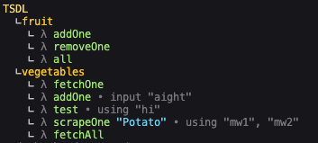

# Documented TSDL

TSDL comes with built-in documentation utilities.
It's 100% optional to document your backend.

## Usage

`input`, `query` and `use` have a method called `doc`, it's invoked as such:

```ts
tsdl
  .use
  .doc(
    "Fetch potatoes"
  )(() => ["potato"])
  .query(({ ctx }) => ctx),
```

You can also add a description:

```ts
tsdl
  .use
  .doc(
    "Fetch potatoes",
    "Potatoes can be cooked in many different ways"
  )(() => ["potato"])
  .query(({ ctx }) => ctx),
```

The `doc` method has 2 overloads

```ts
tsdl
  .input
  .doc({
    name: "uuid",
    description: "User ID"
  })(z.string().uuid())
  .query(() => "..."),
```

## Auto docs

TSDL provides a package called `@tsdl/tree`.

```sh
npm i @tsdl/tree
```

### Create tree

```ts
import { createTree } from "router";
const tree = createTree(router); // typeof Tree
```

Tree type:

```ts
type Tree = {
  /** the complete path to the leaf */
  path: string[];
  /** child nodes, will be empty if leaf */
  nodes: Tree[];
  /** if true, this is a query (leaf node) */
  leaf: boolean;
  /** documentation of the input */
  inputDoc?: CommonDoc;
  /** documentation of the query */
  queryDoc?: CommonDoc;
  /** documentation of the middlewares in order */
  mwDoc: CommonDoc[];
};
type CommonDoc = {
  name: string | null;
  description: string | null;
};
```

It's up to you what you want to do with your tree.
A common use cases is to send it to a front-end for documentation.

### Visualize tree



There is a built in method for visualizing your back-end in your console.

To do this invoke `visualizeTree`:

```ts
import { createTree, visualizeTree } from "router";
console.log(visualizeTree(createTree(router)));
```
